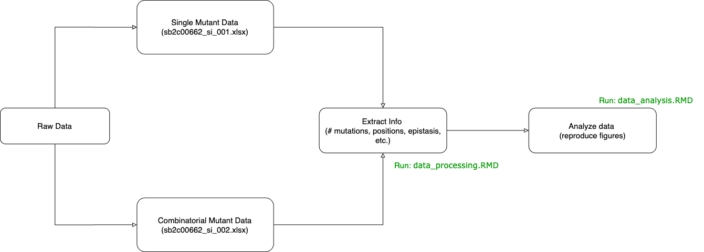

# Reproduction of *Deep Mutational Scanning of an Oxygen-Independent Fluorescent Protein CreiLOV for Comprehensive Profiling of Mutational and Epistatic Effects*

This repository contains code, data, and figures for reproducing the results presented in:

> **Citation Information**  
**Chen, Y., Hu, R., Li, K., Zhang, Y., Fu, L., Zhang, J., & Si, T. (2023)**. *Deep Mutational Scanning of an Oxygen-Independent Fluorescent Protein CreiLOV for Comprehensive Profiling of Mutational and Epistatic Effects*. ACS Synthetic Biology, 12(5), 1461–1473. https://doi.org/10.1021/acssynbio.2c00662


## Overview

This project attempts to reproduce a subset of the main analyses and figures of the paper. It includes:

- Overview of the paper we are trying to replicate and the results that we obtained ([`chen_et_al-2023.MD`](chen_et_al-2023.MD))
- Preprocessed and raw data from the paper in ([`data/`](data/))
- Scripts used to process the raw data, analyze the data, and plot the figures for our replication attempt([`analysis_pipeline/`](analysis_pipeline/))
- Replicated figures ([`figures/`](figures/))
- PDF versions of the RMD processing and analysis code showing what the output should look like. ([`analysis_pipeline/`](analysis_pipeline/)) 

## 🗂️ Repository Structure

```
.
├── analysis_pipeline
│   ├── data_analysis.pdf
│   ├── data_analysis.RMD
│   ├── data_processing.pdf
│   └── data_processing.RMD
├── chen_et_al-2023.MD
├── data
│   ├── processed
│   │   ├── combinatorial_mutant_data.csv
│   │   └── single_mutant_data.csv
│   └── raw
│       ├── sb2c00662_si_001.xlsx
│       └── sb2c00662_si_002.xlsx
├── data_analysis_flowchart.png
├── figures
│   ├── fig_1b
│   │   ├── fig_1b_1.png
│   │   ├── fig_1b_2.png
│   │   └── fig_1b_3.png
│   ├── fig_2a.png
│   ├── fig_2b_heatmap.png
│   ├── fig_2b_lower.png
│   ├── fig_3a.png
│   ├── fig_3b.png
│   ├── fig_3d.png
│   └── fig_3e.png
└── README.MD
```

## 📦 Requirements

This project was written in R and was run in Rstudio Version 2024.12.1+563 (2024.12.1+563). To install Rstudio, follow the instructions for your given operating system: https://posit.co/download/rstudio-desktop/


It requires several R libraries and these are described at the beginning of the [`analysis_pipeline/data_processing.RMD`](analysis_pipeline/data_processing.RMD) and [`analysis_pipeline/data_analysis.RMD`](analysis_pipeline/data_analysis.RMD) scripts.


### Required Libaries (and Versions Used)

| Package     | Version  |
|-------------|----------|
| scales      | 1.3.0    |
| openxlsx    | 4.2.8    |
| pbapply     | 1.7.2    |
| readxl      | 1.4.3    |
| lubridate   | 1.9.4    |
| forcats     | 1.0.0    |
| stringr     | 1.5.1    |
| dplyr       | 1.1.4    |
| purrr       | 1.0.4    |
| readr       | 2.1.5    |
| tibble      | 3.2.1    |
| ggplot2     | 3.5.1    |
| tidyverse   | 2.0.0    |
| tidyr       | 1.3.1    |
| ggpmisc     | 0.6.1    |
| ggpp        | 0.5.8.1  |
| ggbeeswarm  | 0.7.2    |


## How to Reproduce

1. Clone this repository:

   ```bash
   git clone https://github.com/RGodin-ISU/BCB546-Final_Project.git
   cd BCB546-Final_Project
   ```

2. Install dependencies (see above).

3. Run the data processing and data analysis scripts in the [`analysis_pipeline/`](analysis_pipeline/) folder. Examples of the output are provided as PDFs in the folder:
   1. First, run [`analysis_pipeline/data_processing.RMD`](analysis_pipeline/data_processing.RMD) to process the raw data for analysis. The output processed data files are stored in [`data/processed`](data/processed).
   2. Second, run [`analysis_pipeline/data_analysis.RMD`](analysis_pipeline/data_analysis.RMD). The output figures are printed to the terminal but also saved to [`figures/`](figures/) for analysis.

## 📁 Data

- **Raw data:** See [`data/raw/`](data/raw/). These are the original datasets as described in the paper. 
  - [`sb2c00662_si_001.xlsx`](data/raw/sb2c00662_si_001.xlsx) contains activity data for single point mutations.
  - [`sb2c00662_si_002.xlsx`](data/raw/sb2c00662_si_002.xlsx) contains activity data for the combinatorial (multi-site) mutations.
- **Processed data:** See [`data/processed/`](data/processed/). These are derived from the raw data and used in the analysis scripts for figure generation.

### Data Analysis Pipeline



## 📊 Figures

The main figures replicated from the paper are saved in [`figures/`](figures/). Each figure is labeled corresponding to the figure number in the paper, e.g., `fig_1b.png`.

## 📝 Notes

- While the overall results are consistent, there are slight differences, likely due to unavailable details. These are described in more detail in [`chen_et_al-2023.MD`](chen_et_al-2023.MD).

